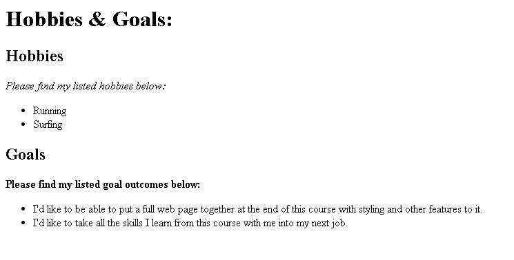
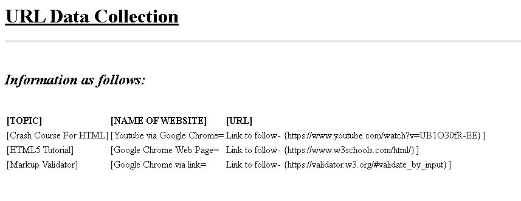

# first-html-doc

## Welcome to the start of my journey into the coding field!!!

This is my very first html document that I put together that can be viewed in the browser.

<b>There are two html pages attacted to this project:</b>

The first project focuses on the standard HTML page structure & layout.

The second project focuses on HTML data tables.

## Page 1 Example, HTML layout:

## Page 2 Example, HTML tables:

Happy Coding :sunglasses:
